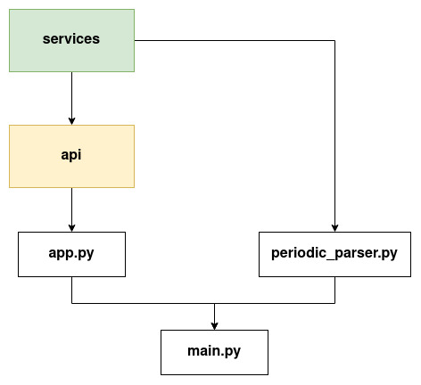
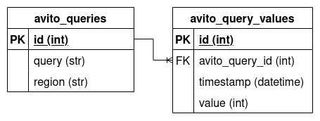

# Technical documentation

## :orange_book: Architecture

Original: [modules_diagram.drawio](./modules_diagram.drawio)

## :blue_book: Database schema

Original: [database_schema.drawio](./database_schema.drawio)

## :file_folder: Folders and files

- **src/tracker** - application source code
    - **api** - folder with API handler
    - **migrations** - alembic migrations folder
    - **services** - folder with business-logic
    - app.py - file with FastAPI application object
    - db.py - file with configuration of SQLAlchemy
    - exceptions.py - file with custom exceptions
    - main.py - main application file
    - models.py - file with SQLAlchemy models
    - schemas.py - file with Pydantic models
    - settings.py - file with application settins
    - utils.py - file with application utils
- **tests** - application unit and integration tests
- **docs** - application documentation
- **docker-compose.yaml** - Docker compose config to run PostgreSQL

## :arrow_left: [Back to README](../README.md)